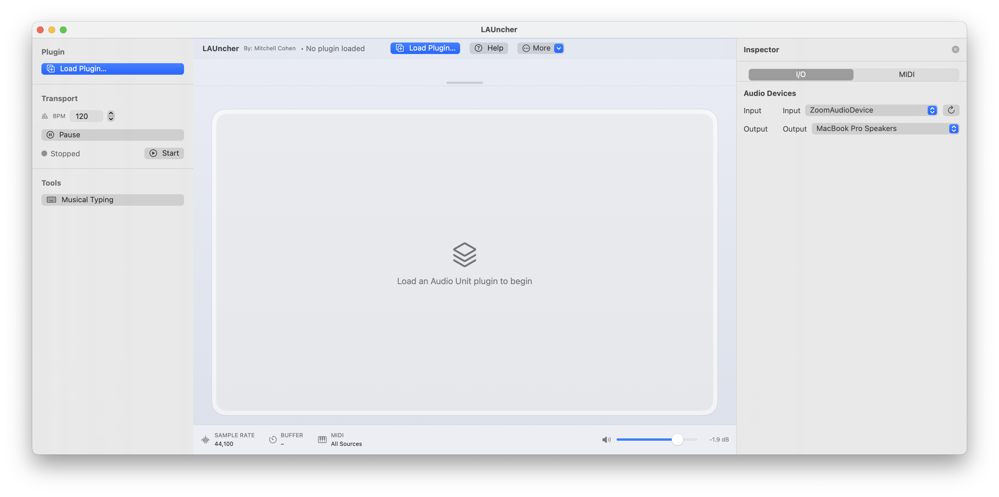
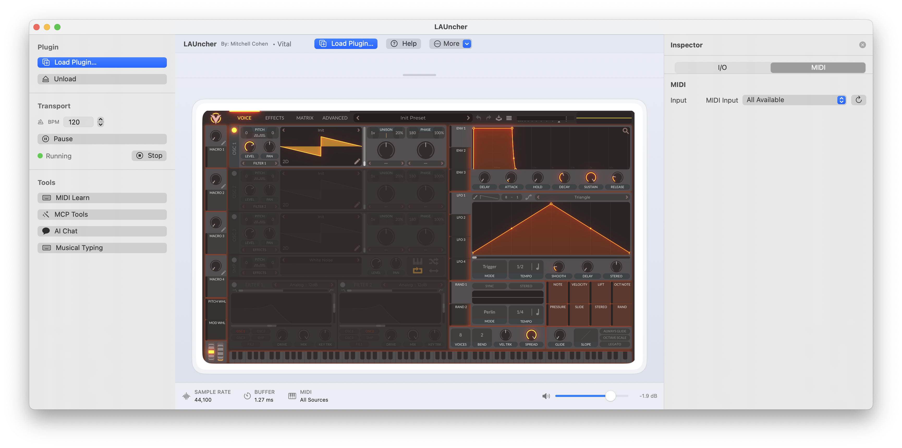
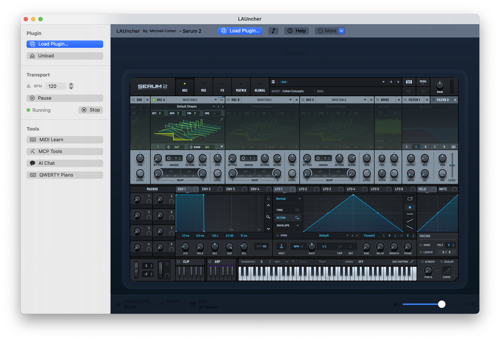
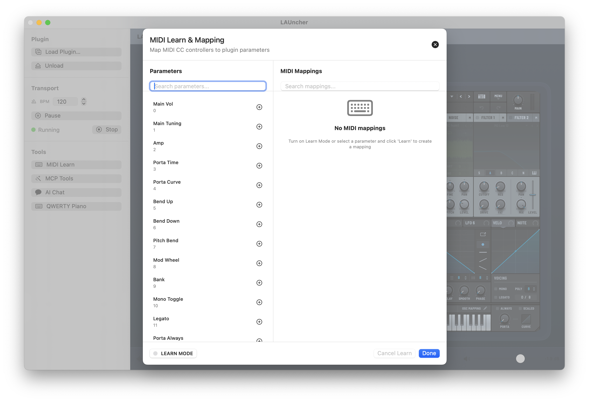
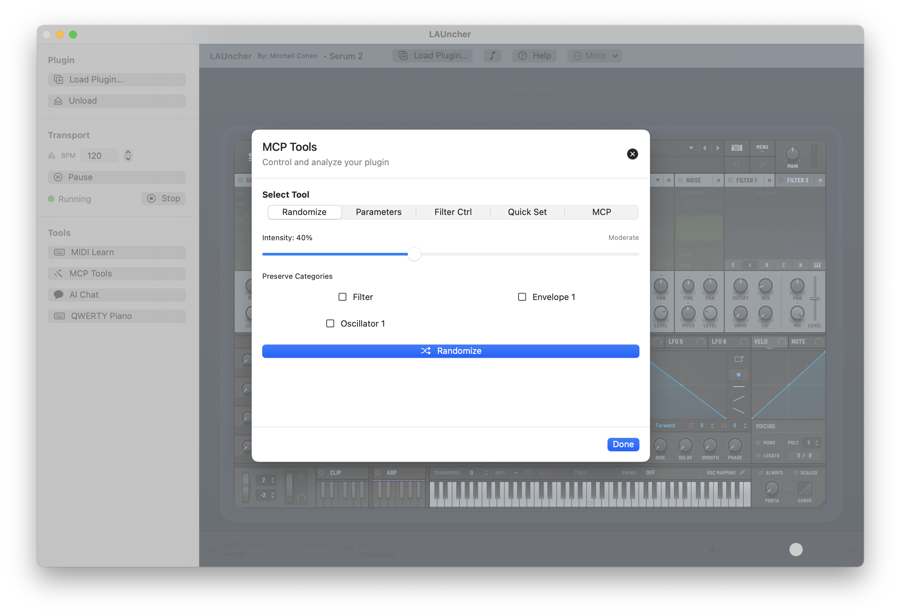
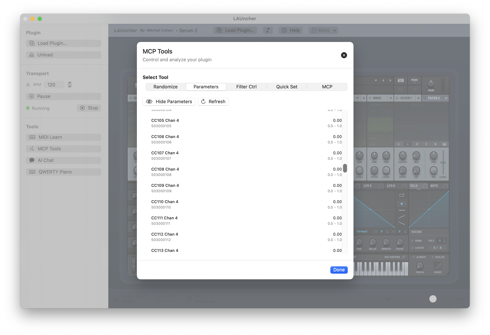

# LAUncher

<div align="center">

**A powerful, modern macOS Audio Unit host for both AU 2 and AUv3 plugins**

*Built with SwiftUI and AVFoundation*

[](https://www.apple.com/macos/)
[](https://swift.org/)
[](https://developer.apple.com/xcode/)

</div>

---

## Overview

**LAUncher** is a professional-grade Audio Unit host application designed for macOS. It provides a clean, modern interface for loading and using both traditional AU 2 plugins and modern AUv3 app extensions. Whether you're a music producer, sound designer, or audio enthusiast, LAUncher offers the tools you need to work with your favorite plugins.

### Key Features

- 🎹 **Universal Plugin Support** - Load both AU 2 (traditional) and AUv3 (app extension) plugins seamlessly
- 🎨 **Customizable Themes** - Choose from built-in themes or create your own custom color schemes
- ⌨️ **QWERTY Piano** - Built-in QWERTY keyboard for playing notes without a MIDI controller
- 🎛️ **MIDI Learn** - Map MIDI CC messages to plugin parameters with intuitive learn mode
- 🎚️ **Transport Control** - Play/pause transport with accurate BPM sync for tempo-synced effects
- 📊 **Parameter Export** - Export plugin parameters as JSON for backup and sharing
- 🤖 **AI Integration** - Built-in MCP (Model Context Protocol) server for AI-powered workflows
- 🎯 **Low Latency** - Optimized audio engine for real-time performance
- 🎨 **Modern UI** - Beautiful SwiftUI interface with resizable toolbar and sidebar inspector

---

## Screenshots

<div align="center">

<table>
<tr>
<td align="center">
<details>
<summary>📸</summary>
<a href="docs/screenshots/launcher1.png"></a>
</details>
</td>
<td align="center">
<details>
<summary>📸</summary>
<a href="docs/screenshots/launcher2.png"></a>
</details>
</td>
<td align="center">
<details>
<summary>📸</summary>
<a href="docs/screenshots/midi-learn.png"></a>
</details>
</td>
</tr>
<tr>
<td align="center">
<details>
<summary>📸</summary>
<a href="docs/screenshots/inspector-panel.png"></a>
</details>
</td>
<td align="center">
<details>
<summary>📸</summary>
<a href="docs/screenshots/theme-selection.png"></a>
</details>
</td>
<td align="center">
<details>
<summary>📸</summary>
<a href="docs/screenshots/qwerty-piano.png"></a>
</details>
</td>
</tr>
</table>

</div>

### Video Demo

**[🎥 Watch Demo Video on Screen Studio](https://screen.studio/share/FXBl0src)**

*Recorded and shared using Screen Studio*

---

## Requirements

- **macOS**: 15.7 or later
- **Xcode**: 15.0 or later
- **Swift**: 5.0+

---

## Installation

### Building from Source

1. **Clone the repository:**
   ```bash
   git clone <repository-url>
   cd LAUncher
   ```

2. **Open the project in Xcode:**
   ```bash
   open LAUncher.xcodeproj
   ```

3. **Build and run:**
   - Select the "LAUncher" scheme
   - Choose your Mac as the destination
   - Press ⌘R to build and run

### Plugin Locations

LAUncher automatically discovers plugins from standard macOS locations:

- `/Library/Audio/Plug-Ins/Components/` (system-wide plugins)
- `~/Library/Audio/Plug-Ins/Components/` (user-specific plugins)

---

## Usage

### Getting Started

1. **Launch LAUncher**
2. **Load a Plugin** - Click "Load Plugin…" in the toolbar to browse available plugins
3. **Select a Plugin** - Choose from the list of discovered Audio Units
4. **Play Notes** - Use MIDI input, QWERTY Piano keyboard, or the on-screen keyboard
5. **Adjust Parameters** - Use the plugin's native UI to tweak settings
6. **Control Transport** - Use the play/pause button to control BPM-synced effects

### Features Guide

#### QWERTY Piano
Enable QWERTY Piano to use your QWERTY keyboard as a MIDI controller. The on-screen keyboard can be toggled on/off and repositioned by dragging.

#### MIDI Learn
1. Click "MIDI Learn" in the More menu
2. Click a parameter in the plugin UI
3. Move a MIDI CC control on your device
4. The mapping is saved automatically

#### Themes
Choose from built-in themes (Dark, Light, Midnight, Sunset, Ocean, Forest, Neon, Monochrome, Amethyst, Emerald, Fire) or create custom themes. Themes update immediately when selected. Access themes from the More menu.

#### Transport Control
The transport play/pause button controls tempo synchronization. When playing, plugins like Serum will sync their LFOs and effects to the host BPM.

#### Inspector Panel
Toggle the sidebar inspector (right side) to access:
- Audio device selection (Input/Output)
- MIDI input selection
- Plugin information

#### Left Sidebar
The left sidebar provides quick access to:
- Plugin loading and management
- Transport controls (BPM, Play/Pause)
- Engine status and controls
- Quick tools (MIDI Learn, MCP Tools, AI Chat)
- QWERTY Piano toggle

---

## MCP (Model Context Protocol) Integration

LAUncher includes a built-in MCP server that enables AI-powered workflows for plugin control and patch management. The MCP server runs locally on port 5555 and exposes tools for interacting with your plugins programmatically.

### MCP Server Features

The MCP server provides the following tools:

1. **get_parameters** - Retrieve all parameters from the current plugin with filtering options
2. **set_parameters** - Batch update multiple parameter values
3. **get_patch_snapshot** - Get a structured snapshot of the current patch state
4. **set_patch_snapshot** - Apply a patch snapshot by ID or inline object
5. **save_patch_to_library** - Save patches to a local JSON library with metadata
6. **analyze_patch** - Get musical analysis and timbre descriptions
7. **explain_parameters** - Get explanations of what parameters do in musical terms

### Using MCP Tools

Access MCP tools from the toolbar "More" menu → "MCP Tools". The MCP server runs automatically when LAUncher starts and is accessible at `http://localhost:5555`.

### MCP Server Implementation

The MCP server is implemented as a standalone Node.js/TypeScript server (`dev/mcp/launcher-server.js`) that communicates with LAUncher via HTTP API. See `MCP-PRD.md` for detailed API documentation.

### Example MCP Usage

```json
{
  "method": "tools/call",
  "toolName": "get_parameters",
  "arguments": {
    "filter": {
      "pathPrefix": "Filter",
      "onlyAutomatable": true
    }
  }
}
```

For more information, see:
- `MCP-PRD.md` - Complete MCP server specification
- `MCP-SERVER-STATUS.md` - Server implementation status
- `dev/mcp/launcher-server.js` - MCP server implementation

---

## Supported Plugin Types

LAUncher supports all standard Audio Unit types:

- **Music Device** (Instruments) - Synthesizers, samplers, drum machines
- **Effects** - Reverb, delay, distortion, EQ, compression, etc.
- **Generators** - Tone generators, noise sources
- **Mixers** - Audio mixing and routing
- **Panners** - Stereo panning and spatial audio
- **Format Converters** - Sample rate and format conversion
- **Offline Effects** - Non-real-time processing

---

## Architecture

### Project Structure

```
LAUncher/
├── LAUncher/
│   ├── App/
│   │   ├── LAUncherApp.swift          # App entry point
│   │   └── ContentView.swift           # Root content view
│   ├── Managers/
│   │   ├── AudioEngineManager.swift   # Audio engine and plugin loading
│   │   ├── PluginHostSession.swift    # Plugin state management
│   │   ├── MidiManager.swift          # MIDI input handling
│   │   ├── ThemeManager.swift         # Theme management
│   │   └── ...
│   ├── Models/
│   │   ├── AppTheme.swift             # Theme definitions
│   │   └── MidiTypes.swift            # MIDI data models
│   ├── Views/
│   │   ├── RootHostView.swift         # Main window view
│   │   ├── PluginPickerView.swift     # Plugin selection UI
│   │   ├── PluginCanvasView.swift     # Plugin UI container
│   │   ├── TopBarView.swift           # Toolbar controls
│   │   ├── StatusBarView.swift         # Status bar display
│   │   └── ...
│   └── Resources/
│       ├── Assets.xcassets            # App icons and assets
│       └── LAUncher.entitlements      # App entitlements
└── LAUncher.xcodeproj/
```

### Key Components

- **AudioEngineManager**: Handles AVAudioEngine setup, plugin instantiation, and host sync blocks
- **PluginHostSession**: Coordinates plugin state, MIDI, audio devices, and UI state
- **ThemeManager**: Manages theme selection and custom theme persistence
- **MidiManager**: Handles MIDI input from devices and virtual sources

---

## Troubleshooting

### Plugins Not Loading

If you encounter error -3000 or plugins won't load:

1. **Check Entitlements**: Ensure the app has been rebuilt after entitlement changes
2. **Verify Installation**: Check that plugins are properly installed in the Components directories
3. **Check Compatibility**: Verify plugin compatibility with your macOS version
4. **Validate Plugins**: Try validating plugins using: `auval -a`

### Sandbox Restrictions

This app requires specific entitlements to load third-party plugins:

- `com.apple.security.cs.disable-library-validation`
- `com.apple.security.temporary-exception.audio-unit-host`

These are configured in `LAUncher.entitlements`.

### BPM Sync Issues

If plugins aren't syncing to BPM:

1. Ensure the transport is playing (play button should show pause icon)
2. Check that the plugin supports host tempo sync
3. Verify BPM is set correctly in the toolbar

---

## Development

### Building

1. Open `LAUncher.xcodeproj` in Xcode
2. Select the "LAUncher" scheme
3. Choose your Mac as the destination
4. Build (⌘B) or Run (⌘R)

### Code Style

- Follow Swift naming conventions
- Use `@MainActor` for UI-related code
- Prefer `ObservableObject` for state management
- Use SwiftUI best practices for view composition

---

## License

**Personal Use License**

Copyright © 2025 Mitchell Cohen  
Professor of Sound Design & Production @ Berklee College of Music  
Newton, MA

All Rights Reserved

This software is provided for personal, non-commercial use only. You may use, study, and modify this software for your own personal purposes. 

**You may NOT:**
- Sell, rent, lease, or commercialize this software
- Use this software for any commercial or profit-generating purpose
- Redistribute, republish, or distribute this software
- Create derivative works for distribution

See [LICENSE](LICENSE) for full terms and conditions.

For commercial licensing inquiries, please contact Mitchell Cohen.

---

## Credits

**LAUncher** is developed and maintained by **Mitchell Cohen**.

**Mitchell Cohen**  
Professor of Sound Design & Production @ Berklee College of Music  
2025 Newton, MA

All Rights Reserved

Built with:
- SwiftUI for modern, declarative UI
- AVFoundation for audio processing
- AudioToolbox for Audio Unit integration
- CoreAudio for low-level audio control

---

## Acknowledgments

Thanks to the macOS audio development community for their contributions to Audio Unit documentation and best practices.

---

<div align="center">

**LAUncher** - Professional Audio Unit Hosting for macOS

*Made with ❤️ by Mitchell Cohen*

</div>
